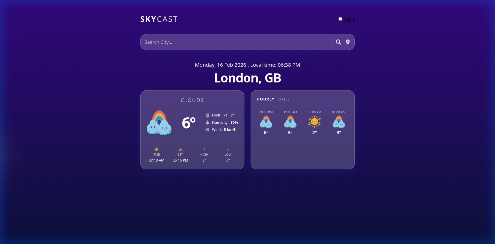
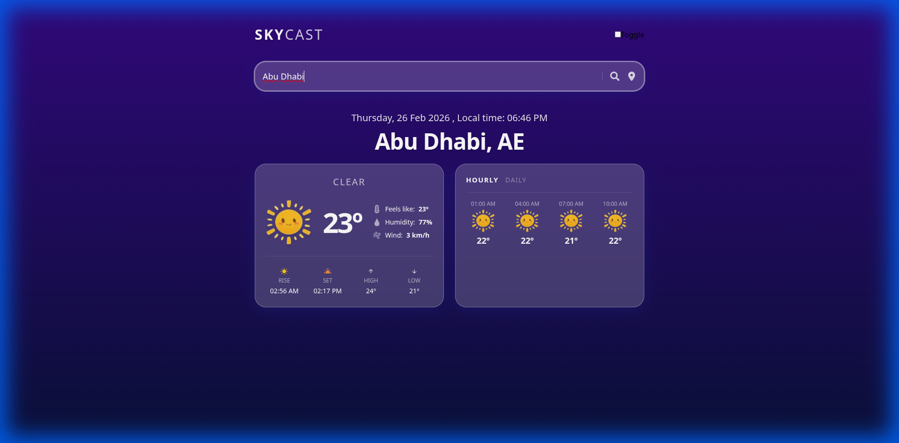
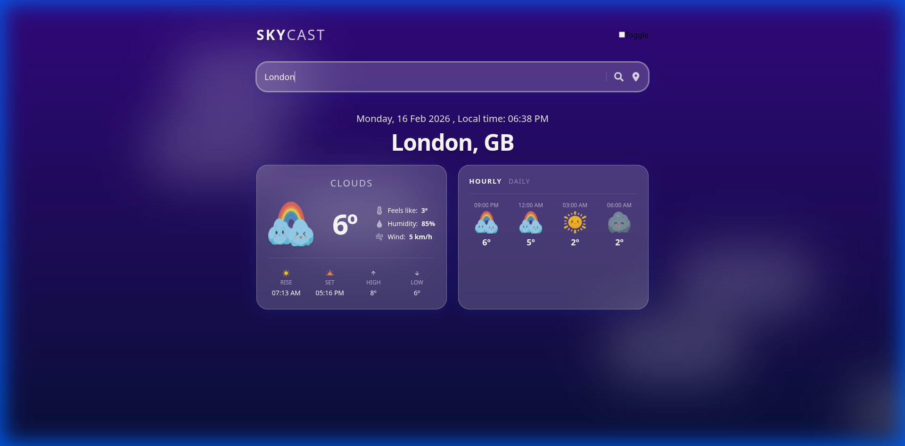
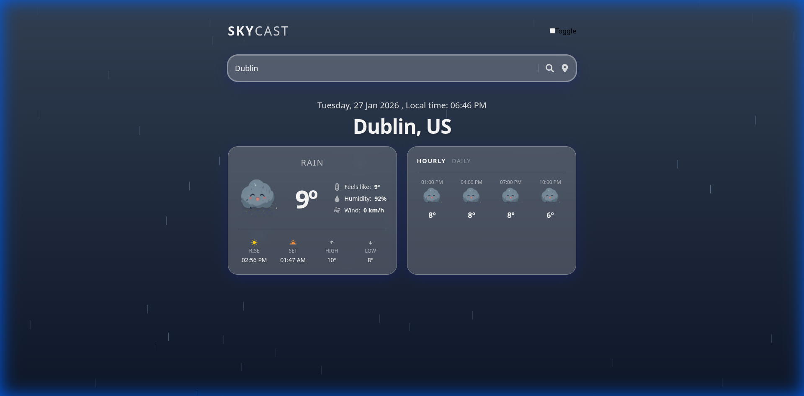
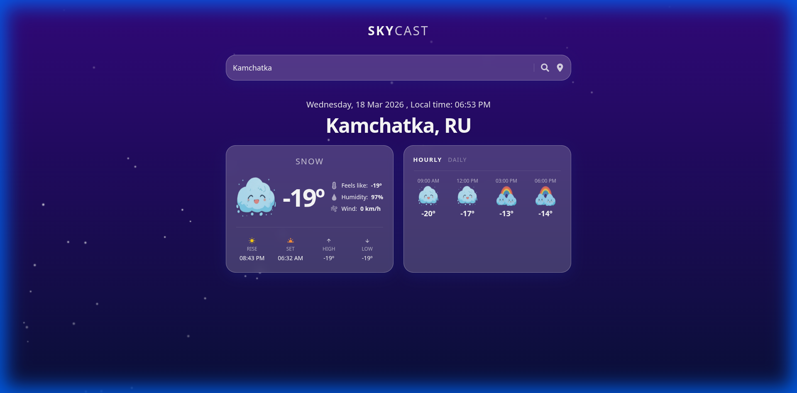
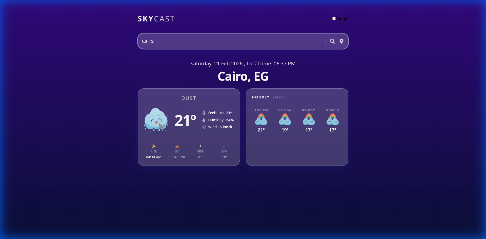

# SkyCast: "Sky Experience" v1.0.0 🌤️

## Introduction

**SkyCast** is a premium web application that transforms weather checking into an immersive experience. It allows you to monitor current conditions and forecasts anywhere in the world with a modern, high-fidelity user interface.



## Key Features

- **💎 Glassmorphic UI**: High-end frosted glass aesthetics with dynamic blur and subtle depth.
- **🎭 Dynamic Atmosphere**: Animated weather layers (Rain, Sun, Clouds, Thunderstorm) that respond to real-time data.
- **🎬 Professional Animations**: Smooth, physics-based staggered entry and city transitions powered by Framer Motion.
- **🌍 Global Search**: Quick access to any city with automatic fallback to standard forecast endpoints for reliability.

### Visual States

| Clear | Clouds | Rain | Snow | Dust |
| :---: | :---: | :---: | :---: | :---: |
|  |  |  |  |  |

## Technologies Used

- **React 18**: Core library for the UI.
- **TypeScript**: Ensuring robust and type-safe code.
- **Tailwind CSS 3**: Modern, performant styling system.
- **Framer Motion**: State-of-the-art animation engine.
- **Luxon**: Powerful date and time manipulation.
- **OpenWeatherMap API**: Reliable source for real-time weather data.

## Description

SkyCast v1.0.0 is the result of a complete rebranding effort ("Sky Experience"). The application features a custom atmospheric engine that renders visual effects behind glassmorphic information cards. It optimizes data fetching to provide a stable experience even with basic API keys, ensuring that weather details like feels-like temperature, humidity, wind speed, and staggered hourly/daily forecasts are always available and beautifully presented.

## How to Install and Run

To run the application in your local environment, follow these steps:

1.  **Requirement**: Ensure you have [Node.js](https://nodejs.org/) installed.
2.  **Clone the repository**:
    ```bash
    git clone https://github.com/aaamaroq/WeatherApp
    ```
3.  **Navigate to the directory**:
    ```bash
    cd WeatherApp
    ```
4.  **Install dependencies**:
    ```bash
    npm install
    ```
5.  **Start the app**:
    ```bash
    npm start
    ```
6.  The application will open at `http://localhost:3000`.

---
*Developed with ❤️ as an immersive weather experience.*
